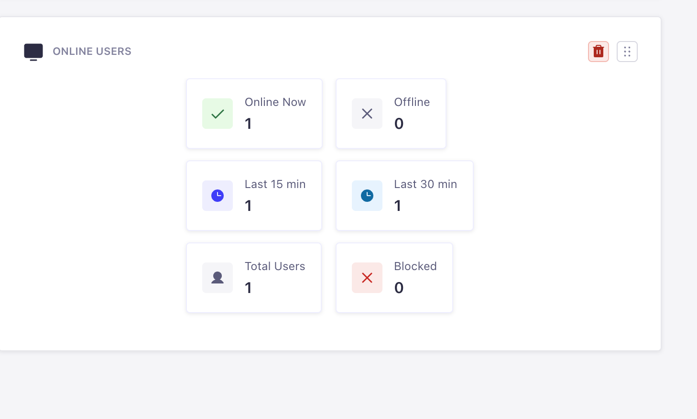
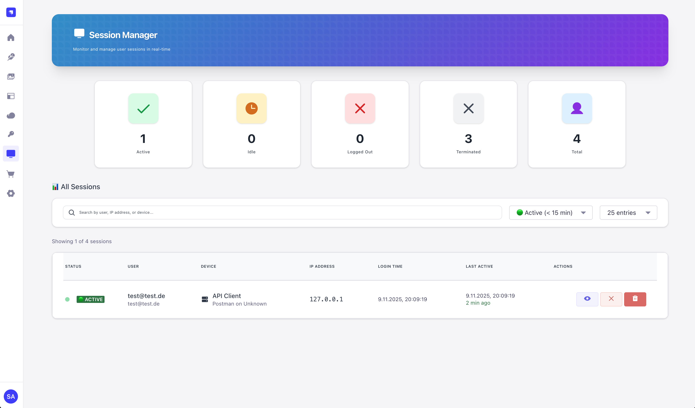
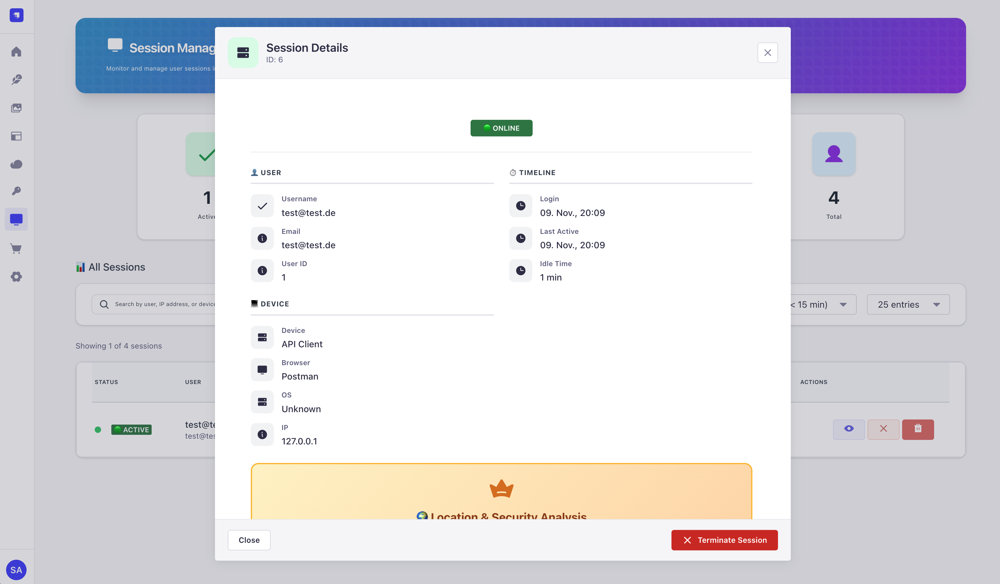
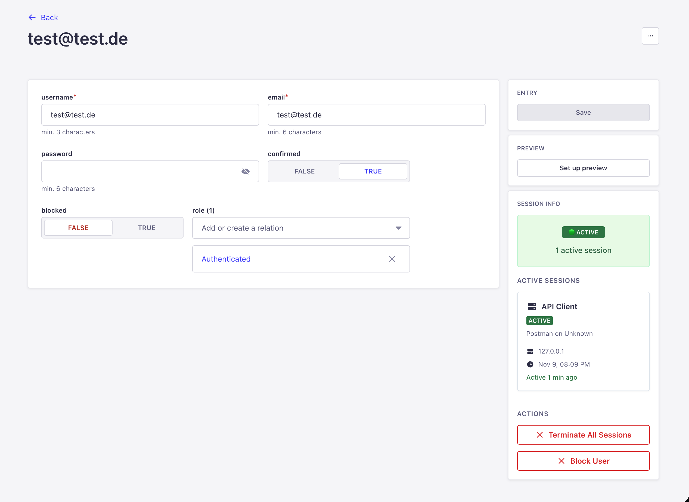
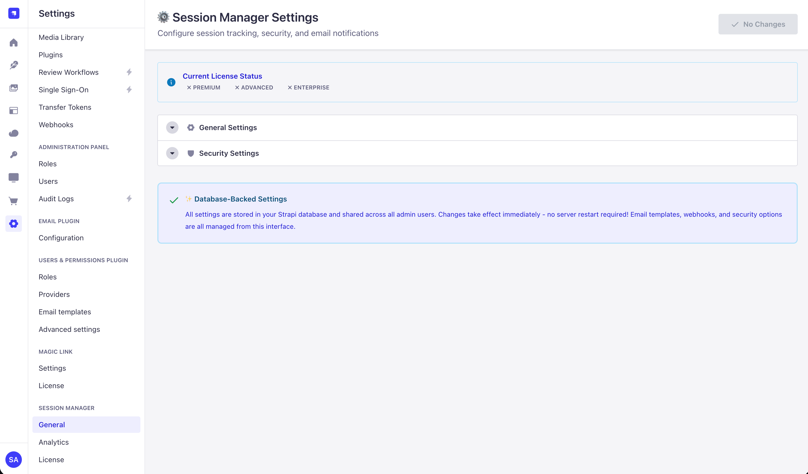
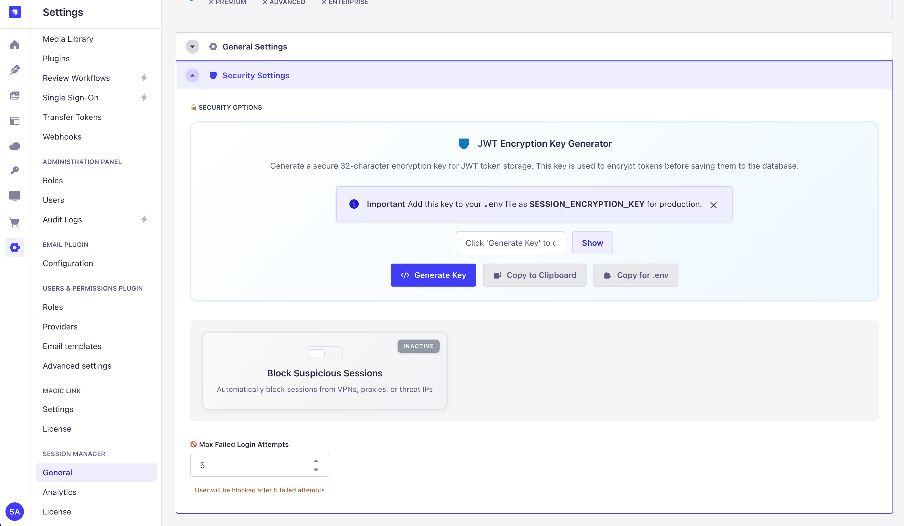

# Magic Session Manager 🔐

**See who's logged into your Strapi app - and control their sessions!**

Track logins, monitor active users, and secure your app with one simple plugin. No complicated setup required.

[](https://www.npmjs.com/package/strapi-plugin-magic-sessionmanager)
[](LICENSE)

---

## 📸 What It Looks Like

### Homepage Widget - Quick Stats at a Glance



**On your Strapi homepage:**
- See online users instantly
- Active in last 15/30 minutes
- Total users count
- Blocked users count
- No need to navigate anywhere!

---

### Main Dashboard - See All Active Sessions



**What you see:**
- Who is logged in right now (green = online)
- When they logged in
- What device they're using
- Their IP address and location
- One-click session termination

---

### Session Details Modal



**Click any session to see:**
- Full device information
- Browser and operating system
- Complete session history
- IP geolocation (Premium)
- Security risk score (Premium)

---

### Content Manager Integration



**When viewing a user:**
- Sidebar shows their active sessions
- Quick actions (terminate, block)
- Offline/Online status indicator
- No need to leave the page!

---

### Settings Page



**Easy configuration:**
- Session timeouts
- Rate limiting
- Email alerts
- Webhook notifications
- Geo-blocking rules



**Advanced security:**
- Encryption key generator (one click!)
- Country allow/block lists
- VPN detection
- Threat blocking

---

## ✨ What This Plugin Does

### Simple Version

**When users login:**
- Plugin saves who logged in, when, and from where
- You can see them in the dashboard (see screenshot above)
- You can force-logout anyone anytime

**When users logout:**
- Plugin marks their session as "logged out"
- They disappear from the active sessions list

**While users are active:**
- Plugin updates their "last seen" time
- You always know who's currently using your app

---

## 🚀 Quick Install

### Step 1: Install

```bash
npm install strapi-plugin-magic-sessionmanager
```

### Step 2: Enable Plugin

Add this to `config/plugins.ts`:

```typescript
export default () => ({
  'magic-sessionmanager': {
    enabled: true,
  },
});
```

### Step 3: Rebuild & Start

```bash
npm run build
npm run develop
```

### Step 4: Open Dashboard

1. Go to Strapi Admin: `http://localhost:1337/admin`
2. Look in the left sidebar for **"Sessions"**
3. Click it!
4. You'll see the dashboard (like the screenshot above)

**That's it! You're done!**

---

## 🔐 Security Features (Optional)

### Encryption Key (Recommended)

Your JWT tokens are encrypted before saving to database. Generate a key:

**In Admin Panel:**
1. Go to **Sessions → Settings**
2. Scroll to **"JWT Encryption Key Generator"**
3. Click **"Generate Key"**
4. Click **"Copy for .env"**
5. Paste into your `.env` file
6. Restart Strapi

**Or generate manually:**
```bash
node -e "console.log(require('crypto').randomBytes(32).toString('base64'))"
```

Then add to `.env`:
```
SESSION_ENCRYPTION_KEY=your-key-here
```

**Why?** If someone hacks your database, they can't steal user sessions! 🔒

---

## 🎯 Main Features Explained Simply

### 1. See Who's Logged In

**Dashboard Tab:**
- Shows all active users
- Green badge = currently online
- Gray badge = logged out
- Click to see details

### 2. Force Logout Anyone

**Need to kick someone out?**
1. Find their session
2. Click **"Terminate"**
3. Done! They're logged out immediately

**Even works if they have refresh tokens!** (See below)

### 3. Session Details

**Click any session to see:**
- When they logged in
- Last time they did something
- What browser/device they use
- Their IP address
- Location (if Premium)

### 4. Multiple Devices

**Users can login from:**
- Desktop computer
- Phone
- Tablet
- All at the same time!

Each login = separate session. You can see them all and logout each individually.

### 5. Auto-Cleanup

**Inactive sessions are automatically cleaned up:**
- If user doesn't do anything for 15 minutes (configurable)
- Session is marked as "inactive"
- Keeps your database clean

---

## 🔒 Refresh Token Protection (Advanced)

### The Problem (Without This Plugin)

```
Admin kicks out a user
   ↓
User has "refresh token"
   ↓
User gets new login token automatically
   ↓
User is back in! 😱
```

### The Solution (With This Plugin)

```
Admin kicks out a user
   ↓
User tries to use refresh token
   ↓
Plugin blocks it! 🚫
   ↓
User MUST login again
```

**How to enable:**

Add to `config/plugins.ts`:

```typescript
'users-permissions': {
  config: {
    jwtManagement: 'refresh',  // Enable refresh tokens
    sessions: {
      accessTokenLifespan: 3600,  // 1 hour
      maxRefreshTokenLifespan: 2592000,  // 30 days
    },
  },
}
```

**What this does:**
- Users stay logged in longer (better experience)
- But admins can still force-logout completely (better security)
- Best of both worlds! ✅

---

## 🌍 Premium Features (Optional License)

### IP Geolocation

**See where users login from:**
- Country (with flag! 🇩🇪🇺🇸🇬🇧)
- City
- ISP Provider
- Coordinates (for map)

### Threat Detection

**Automatically check if IP is:**
- VPN
- Proxy
- Known threat
- Security score (0-100)

### Auto-Blocking

**Block logins from:**
- Specific countries
- VPNs or proxies
- Low security score IPs
- Known threat IPs

### Notifications

**Get alerts when:**
- Suspicious login detected
- VPN used
- New location login
- Send to Discord or Slack!

---

## 📧 Email Alerts Setup (Premium)

The Session Manager uses **Strapi's Email Plugin** to send notifications. You need to configure an email provider first.

### Step 1: Install Email Provider

Choose one of these providers:

**Option A: Nodemailer (Recommended)**
```bash
npm install @strapi/provider-email-nodemailer
```

**Option B: SendGrid**
```bash
npm install @strapi/provider-email-sendgrid
```

**Option C: Mailgun**
```bash
npm install @strapi/provider-email-mailgun
```

### Step 2: Configure Email Plugin

Add to `config/plugins.ts`:

```typescript
export default () => ({
  // Email configuration
  email: {
    config: {
      provider: 'nodemailer',
      providerOptions: {
        host: process.env.SMTP_HOST || 'smtp.gmail.com',
        port: process.env.SMTP_PORT || 587,
        auth: {
          user: process.env.SMTP_USER,
          pass: process.env.SMTP_PASSWORD,
        },
      },
      settings: {
        defaultFrom: process.env.SMTP_DEFAULT_FROM || 'noreply@yourapp.com',
        defaultReplyTo: process.env.SMTP_DEFAULT_REPLY_TO || 'support@yourapp.com',
      },
    },
  },
  
  // Session Manager configuration
  'magic-sessionmanager': {
    enabled: true,
  },
});
```

### Step 3: Add Environment Variables

Add to your `.env` file:

```env
SMTP_HOST=smtp.gmail.com
SMTP_PORT=587
SMTP_USER=your-email@gmail.com
SMTP_PASSWORD=your-app-password
SMTP_DEFAULT_FROM=noreply@yourapp.com
SMTP_DEFAULT_REPLY_TO=support@yourapp.com
```

**For Gmail:**
- Use an [App Password](https://support.google.com/accounts/answer/185833), not your regular password!

### Step 4: Enable in Admin Panel

1. Go to **Sessions → Settings**
2. Scroll to **"Email Notifications"**
3. Toggle **"Enable Email Alerts"** to ON
4. Customize email templates (optional)
5. Click **Save**

### Step 5: Test It

Trigger a suspicious login (e.g., use a VPN) and check if the email arrives!

**Troubleshooting:**
- Check Strapi logs for email errors
- Verify SMTP credentials are correct
- Test SMTP connection with a tool like [smtp-tester](https://www.npmjs.com/package/smtp-tester)

---

## 📋 Simple API Guide

### Get Sessions

```bash
# Get all active sessions
GET /magic-sessionmanager/sessions
```

### Logout

```bash
# Logout current user
POST /api/auth/logout
```

### Force Logout

```bash
# Admin force-logout a session
POST /magic-sessionmanager/sessions/:sessionId/terminate
```

**That's all you need to know!**

---

## ⚙️ Settings You Can Change

**In `config/plugins.ts`:**

```typescript
'magic-sessionmanager': {
  config: {
    // How often to update "last seen" (in milliseconds)
    lastSeenRateLimit: 30000,  // Default: 30 seconds
    
    // When to mark sessions inactive (in milliseconds)
    inactivityTimeout: 900000,  // Default: 15 minutes
  },
}
```

**In Admin Panel (Settings Tab):**
- Email alerts on/off
- Webhook URLs (Discord/Slack)
- Countries to block/allow
- VPN detection on/off
- Generate encryption key

---

## 🐛 Common Problems & Fixes

### I don't see the Sessions menu

**Fix:**
1. Make sure plugin is in `config/plugins.ts`
2. Run `npm run build`
3. Restart Strapi
4. Refresh browser (Cmd+Shift+R)

### Sessions not being created

**Fix:**
1. Check Strapi logs for errors
2. Make sure users are logging in (not already logged in)
3. Check database is working

### 401 or 403 errors

**Fix:**
- 401 = Not logged in (need to login as admin)
- 403 = Not allowed (check you're admin, not regular user)

### Database table "sessions" already exists

**Fix:**
- This plugin uses `magic_sessions` table (not `sessions`)
- If you see this error, another plugin is using that name
- Our plugin automatically uses the correct name

---

## 💡 When To Use This Plugin

**Perfect for:**
- Multi-tenant apps (see which tenant users are online)
- E-commerce (track customer sessions)
- Collaboration tools (show who's currently working)
- Security-critical apps (force-logout compromised accounts)
- Compliance requirements (session audit logs)

**Not needed if:**
- Single-user app
- No need to see who's logged in
- No security requirements

---

## 🔧 How To Test It

### Quick Manual Test

1. **Login to your Strapi app** (frontend or admin)
2. **Go to Admin → Sessions**
3. **You should see your session!**
4. **Click "Terminate" on your session**
5. **Try to use the app → You're logged out!**

### With Postman

**1. Login:**
```
POST http://localhost:1337/api/auth/local
Body: { "identifier": "user@test.com", "password": "pass123" }
```

**2. Check session created:**
```
GET http://localhost:1337/magic-sessionmanager/sessions
```

**3. Logout:**
```
POST http://localhost:1337/api/auth/logout
Authorization: Bearer YOUR_JWT_TOKEN
```

**Done!**

---

## 📦 What Gets Installed

When you install this plugin, you get:

- ✅ Dashboard to see all sessions
- ✅ Session tracking (automatic)
- ✅ Force logout buttons
- ✅ Activity monitoring
- ✅ Encryption (secure)
- ✅ Multi-device support

**Premium features require a license (free to generate):**
- 🔒 IP Geolocation
- 🔒 Threat detection
- 🔒 Auto-blocking
- 🔒 Email/webhook alerts

---

## 🙋 FAQ

**Q: Do I need to change my Strapi code?**  
A: No! Just install and enable the plugin.

**Q: Will this break my existing logins?**  
A: No! It just tracks them, doesn't change them.

**Q: Can users see each other's sessions?**  
A: No! Only admins can see all sessions. Users only see their own.

**Q: What if I uninstall the plugin?**  
A: Sessions will stop being tracked. Everything else works normally.

**Q: Does it slow down my app?**  
A: No! It has smart rate-limiting to prevent database spam.

**Q: Can I customize the dashboard?**  
A: Not yet, but it's planned for future versions!

---

## 📚 Resources

- **NPM:** https://www.npmjs.com/package/strapi-plugin-magic-sessionmanager
- **GitHub:** https://github.com/Schero94/Magic-Sessionmanager
- **Report Bugs:** https://github.com/Schero94/Magic-Sessionmanager/issues

---

## 📄 License

**MIT License** - Free to use for personal and commercial projects!

**Copyright © 2025 Schero D.**

### Important License Restriction

This plugin is **free and open source**, BUT:

⚠️ **You CANNOT modify the license validation system**

This means:
- ❌ Cannot remove `license-guard.js`
- ❌ Cannot bypass license activation
- ❌ Cannot disable license checks
- ❌ Cannot modify license-related endpoints

**Why?** The license system ensures:
- Quality and ongoing support
- Spam prevention
- Usage analytics for improvements
- Fair use tracking

**What you CAN do:**
- ✅ Use freely (personal & commercial)
- ✅ View and study source code
- ✅ Report issues and contribute
- ✅ Deploy in production without fees
- ✅ Integrate in your projects

See [LICENSE](./LICENSE) and [COPYRIGHT_NOTICE.txt](./COPYRIGHT_NOTICE.txt) for full terms.

---

## 🌐 Supported Languages

The admin interface is available in **5 languages:**

- 🇬🇧 **English** - Default
- 🇩🇪 **Deutsch** - German
- 🇪🇸 **Español** - Spanish
- 🇫🇷 **Français** - French
- 🇵🇹 **Português** - Portuguese

Language automatically follows your Strapi admin interface setting.

---

**Made for Strapi v5**
