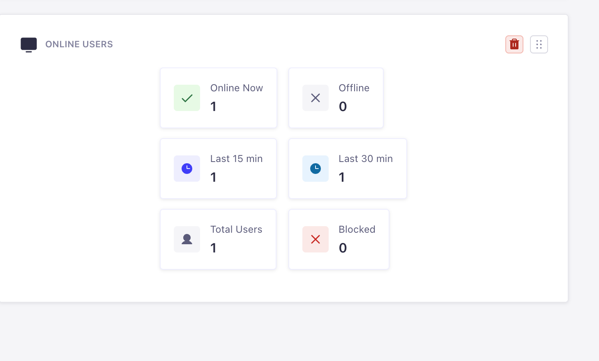
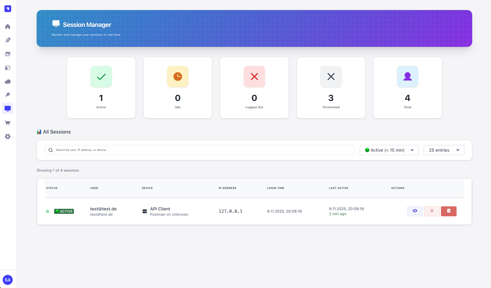
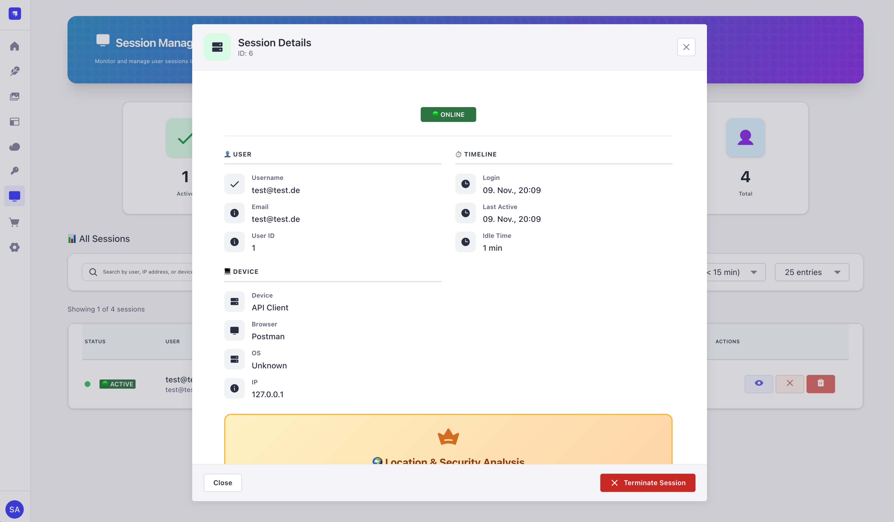
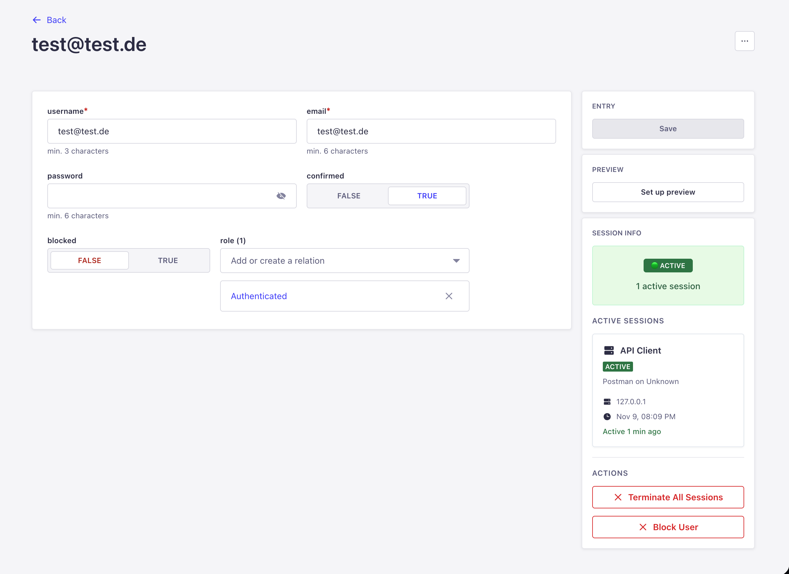
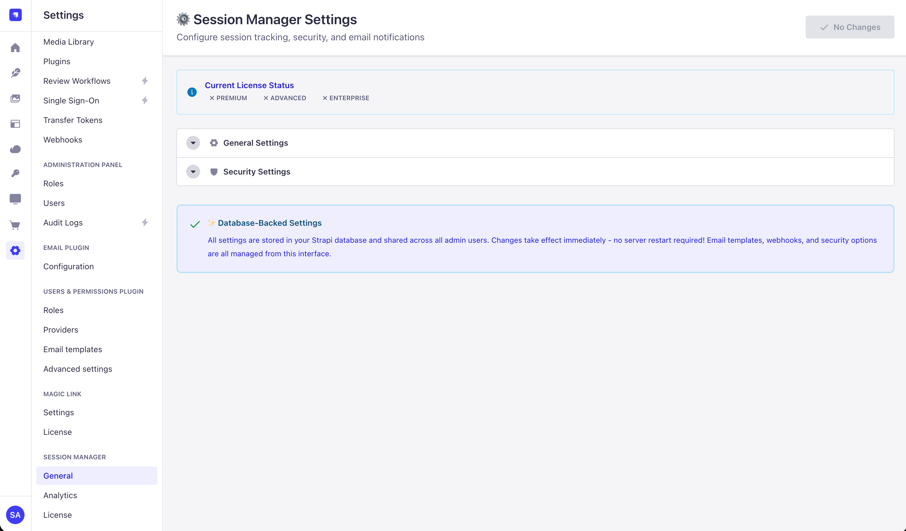
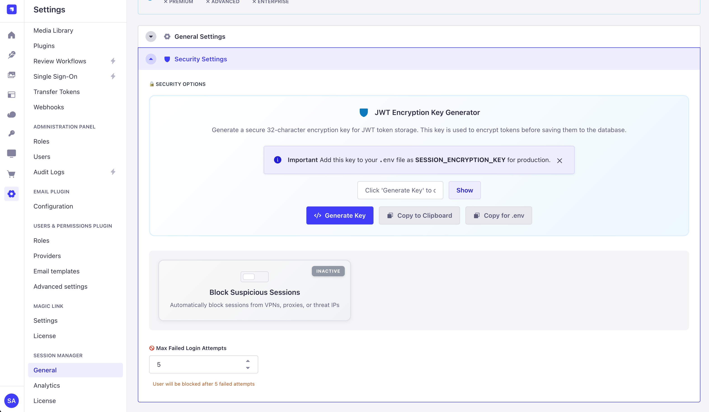

# Magic Session Manager 🔐

**See who's logged into your Strapi app - and control their sessions!**

Track logins, monitor active users, and secure your app with one simple plugin. No complicated setup required.

Free and open under the MIT license. All features are available without a paid license or activation key.

[](https://www.npmjs.com/package/strapi-plugin-magic-sessionmanager)
[](LICENSE)

---

## 📸 What It Looks Like

### Homepage Widget - Quick Stats at a Glance



**On your Strapi homepage:**
- See online users instantly
- Active in last 15/30 minutes
- Total users count
- Blocked users count
- No need to navigate anywhere!

---

### Main Dashboard - See All Active Sessions



**What you see:**
- Who is logged in right now (green = online)
- When they logged in
- What device they're using
- Their IP address and location
- One-click session termination

---

### Session Details Modal



**Click any session to see:**
- Full device information
- Browser and operating system
- Complete session history
- IP geolocation
- Security risk score

---

### Content Manager Integration



**When viewing a user:**
- Sidebar shows their active sessions
- Quick actions (terminate, block)
- Offline/Online status indicator
- No need to leave the page!

---

### Settings Page



**Easy configuration:**
- Session timeouts
- Rate limiting
- Email alerts
- Webhook notifications
- Geo-blocking rules



**Advanced security:**
- Encryption key generator (one click!)
- Country allow/block lists
- VPN detection
- Threat blocking

---

## ✨ What This Plugin Does

### Simple Version

**When users login:**
- Plugin saves who logged in, when, and from where
- You can see them in the dashboard (see screenshot above)
- You can force-logout anyone anytime

**When users logout:**
- Plugin marks their session as "logged out"
- They disappear from the active sessions list
- Manual logout permanently blocks session reactivation (security feature)

**Session Timeout vs Manual Logout:**
- **Timeout:** Session can be reactivated on next request (seamless UX)
- **Manual Logout:** Session is permanently terminated (security-first)

**While users are active:**
- Plugin updates their "last seen" time
- You always know who's currently using your app

---

## 🚀 Quick Install

### Step 1: Install

```bash
npm install strapi-plugin-magic-sessionmanager
```

### Step 2: Enable Plugin

Add this to `config/plugins.ts`:

```typescript
export default () => ({
  'magic-sessionmanager': {
    enabled: true,
  },
});
```

### Step 3: Rebuild & Start

```bash
npm run build
npm run develop
```

### Step 4: Open Dashboard

1. Go to Strapi Admin: `http://localhost:1337/admin`
2. Look in the left sidebar for **"Sessions"**
3. Click it!
4. You'll see the dashboard (like the screenshot above)

**That's it! You're done!**

---

## 🔐 Security Features (Optional)

### Encryption Key (Recommended)

Your JWT tokens are encrypted before saving to database. Generate a key:

**In Admin Panel:**
1. Go to **Sessions → Settings**
2. Scroll to **"JWT Encryption Key Generator"**
3. Click **"Generate Key"**
4. Click **"Copy for .env"**
5. Paste into your `.env` file
6. Restart Strapi

**Or generate manually:**
```bash
node -e "console.log(require('crypto').randomBytes(32).toString('base64'))"
```

Then add to `.env`:
```
SESSION_ENCRYPTION_KEY=your-key-here
```

**Why?** If someone hacks your database, they can't steal user sessions! 🔒

---

## 🎯 Main Features Explained Simply

### 1. See Who's Logged In

**Dashboard Tab:**
- Shows all active users
- Green badge = currently online
- Gray badge = logged out
- Click to see details

### 2. Force Logout Anyone

**Need to kick someone out?**
1. Find their session
2. Click **"Terminate"**
3. Done! They're logged out immediately

**Even works if they have refresh tokens!** (See below)

### 3. Session Details

**Click any session to see:**
- When they logged in
- Last time they did something
- What browser/device they use
- Their IP address
- Location

### 4. Multiple Devices

**Users can login from:**
- Desktop computer
- Phone
- Tablet
- All at the same time!

Each login = separate session. You can see them all and logout each individually.

### 5. Auto-Cleanup

**Inactive sessions are automatically cleaned up:**
- If user doesn't do anything for 15 minutes (configurable)
- Session is marked as "inactive"
- Keeps your database clean

---

## 🔒 Refresh Token Protection (Advanced)

### The Problem (Without This Plugin)

```
Admin kicks out a user
   ↓
User has "refresh token"
   ↓
User gets new login token automatically
   ↓
User is back in! 😱
```

### The Solution (With This Plugin)

```
Admin kicks out a user
   ↓
User tries to use refresh token
   ↓
Plugin blocks it! 🚫
   ↓
User MUST login again
```

**How to enable:**

Add to `config/plugins.ts`:

```typescript
'users-permissions': {
  config: {
    jwtManagement: 'refresh',  // Enable refresh tokens
    sessions: {
      accessTokenLifespan: 3600,  // 1 hour
      maxRefreshTokenLifespan: 2592000,  // 30 days
    },
  },
}
```

**What this does:**
- Users stay logged in longer (better experience)
- But admins can still force-logout completely (better security)
- Best of both worlds! ✅

---

## 🌍 Security Features

### IP Geolocation

**See where users login from:**
- Country (with flag! 🇩🇪🇺🇸🇬🇧)
- City
- ISP Provider
- Coordinates (for map)

### Local GeoIP Firewall (Recommended)

For login blocking and city-level session display, use a local MaxMind
GeoLite2 City database. This avoids remote API timeouts and rate limits in the
login path while still giving the admin UI city, region, timezone and
coordinates. Existing GeoLite2 Country databases remain supported as a
country-only fallback.

1. Create a free MaxMind account and download `GeoLite2-City.mmdb`:
   https://dev.maxmind.com/geoip/geolite2-free-geolocation-data/
2. Store the file on your Strapi server, for example:
   `/var/lib/strapi/GeoLite2-City.mmdb`
3. Configure the plugin:

```bash
MAGIC_SESSIONMANAGER_GEOIP_DATABASE=/var/lib/strapi/GeoLite2-City.mmdb
MAXMIND_EDITION_ID=GeoLite2-City
MAXMIND_ACCOUNT_ID=your-account-id
MAXMIND_LICENSE_KEY=your-license-key
```

You can also manage this from the Strapi admin UI. Open
**Magic Session Manager -> Settings -> Geofencing**, choose `local-mmdb`,
enter the MaxMind account ID and license key, then use **Download / Update DB**.
The plugin stores the credentials in the Strapi plugin store and never returns
the license key to the browser after saving it.

Download or update the database. The CLI updater needs your MaxMind
credentials via environment variables (the in-admin updater stores them in the
Strapi plugin store instead):

```bash
export MAXMIND_ACCOUNT_ID=your_account_id
export MAXMIND_LICENSE_KEY=your_license_key
export MAXMIND_EDITION_ID=GeoLite2-City
npm run geoip:update
```

When installed as a package in a Strapi project, run the packaged binary:

```bash
npx strapi-magic-sessionmanager-geoip
```

The updater checks MaxMind's `Last-Modified` header first and skips the download
when the local metadata is current. Use `npm run geoip:update -- --force` in the
plugin repo or `npx strapi-magic-sessionmanager-geoip --force` in an installed
Strapi project to force a refresh. Schedule it weekly or twice weekly with
cron/systemd. MaxMind requires GeoLite databases to stay up to date and
currently limits GeoLite users to 30 database downloads per day.

```typescript
// config/plugins.ts
export default () => ({
  'magic-sessionmanager': {
    enabled: true,
    config: {
      geoIpProvider: 'local-mmdb',
      geoIpDatabasePath: process.env.MAGIC_SESSIONMANAGER_GEOIP_DATABASE,
      // "auto": fail closed for suspicious-session blocking, fail open for plain geofencing
      // "block": fail closed whenever GEOIP lookup is unavailable
      // "allow": fail open whenever GEOIP lookup is unavailable
      geoLookupFailureMode: 'block',
      enableGeofencing: true,
      allowedCountries: ['DE', 'AT', 'CH'],
    },
  },
});
```

Provider options:
- `local-mmdb`: local MaxMind-compatible database only
- `auto`: use local database when configured, otherwise use the legacy remote provider
- `ipapi`: legacy remote provider
- `disabled`: no GEOIP lookup

Local City and Country databases both support country firewall rules. City
databases additionally populate city, region, timezone, coordinates and postal
data for the admin UI. VPN/proxy/threat detection still requires a provider
that supplies those risk signals; free GeoLite databases do not reliably
identify VPNs or proxies.

### Threat Detection

**Automatically check if IP is:**
- VPN
- Proxy
- Known threat
- Security score (0-100)

### Auto-Blocking

**Block logins from:**
- Specific countries
- VPNs or proxies
- Low security score IPs
- Known threat IPs

### Notifications

**Get alerts when:**
- Suspicious login detected
- VPN used
- New location login
- Send to Discord or Slack!

---

## 📧 Email Alerts Setup

The Session Manager uses **Strapi's Email Plugin** to send notifications. You need to configure an email provider first.

### Step 1: Install Email Provider

Choose one of these providers:

**Option A: Nodemailer (Recommended)**
```bash
npm install @strapi/provider-email-nodemailer
```

**Option B: SendGrid**
```bash
npm install @strapi/provider-email-sendgrid
```

**Option C: Mailgun**
```bash
npm install @strapi/provider-email-mailgun
```

### Step 2: Configure Email Plugin

Add to `config/plugins.ts`:

```typescript
export default () => ({
  // Email configuration
  email: {
    config: {
      provider: 'nodemailer',
      providerOptions: {
        host: process.env.SMTP_HOST || 'smtp.gmail.com',
        port: process.env.SMTP_PORT || 587,
        auth: {
          user: process.env.SMTP_USER,
          pass: process.env.SMTP_PASSWORD,
        },
      },
      settings: {
        defaultFrom: process.env.SMTP_DEFAULT_FROM || 'noreply@yourapp.com',
        defaultReplyTo: process.env.SMTP_DEFAULT_REPLY_TO || 'support@yourapp.com',
      },
    },
  },
  
  // Session Manager configuration
  'magic-sessionmanager': {
    enabled: true,
  },
});
```

### Step 3: Add Environment Variables

Add to your `.env` file:

```env
SMTP_HOST=smtp.gmail.com
SMTP_PORT=587
SMTP_USER=your-email@gmail.com
SMTP_PASSWORD=your-app-password
SMTP_DEFAULT_FROM=noreply@yourapp.com
SMTP_DEFAULT_REPLY_TO=support@yourapp.com
```

**For Gmail:**
- Use an [App Password](https://support.google.com/accounts/answer/185833), not your regular password!

### Step 4: Enable in Admin Panel

1. Go to **Sessions → Settings**
2. Scroll to **"Email Notifications"**
3. Toggle **"Enable Email Alerts"** to ON
4. Customize email templates (optional)
5. Click **Save**

### Step 5: Test It

Trigger a suspicious login (e.g., use a VPN) and check if the email arrives!

**Troubleshooting:**
- Check Strapi logs for email errors
- Verify SMTP credentials are correct
- Test SMTP connection with a tool like [smtp-tester](https://www.npmjs.com/package/smtp-tester)

---

## 📋 Content-API Endpoints (For Frontend/Apps)

All Content-API endpoints require a valid JWT token in the `Authorization` header.
Users can only access their **own** sessions.

### Get My Sessions

Returns all sessions for the authenticated user.

```bash
GET /api/magic-sessionmanager/my-sessions
Authorization: Bearer <JWT>
```

**Response:**
```json
{
  "data": [
    {
      "id": "abc123xyz",
      "documentId": "abc123xyz",
      "sessionId": "sess_m5k2h_8a3b1c2d_f9e8d7c6",
      "ipAddress": "192.168.1.100",
      "userAgent": "Mozilla/5.0 (Macintosh; Intel Mac OS X 10_15_7) AppleWebKit/537.36...",
      "loginTime": "2026-01-02T10:30:00.000Z",
      "lastActive": "2026-01-02T13:45:00.000Z",
      "logoutTime": null,
      "isActive": true,
      "deviceType": "desktop",
      "browserName": "Chrome 143",
      "osName": "macOS 10.15.7",
      "geoLocation": null,
      "securityScore": null,
      "isCurrentSession": true,
      "isTrulyActive": true,
      "minutesSinceActive": 2
    },
    {
      "id": "def456uvw",
      "documentId": "def456uvw",
      "sessionId": "sess_m5k1g_7b2a0c1d_e8d7c6b5",
      "ipAddress": "10.0.0.50",
      "userAgent": "Mozilla/5.0 (iPhone; CPU iPhone OS 17_0 like Mac OS X)...",
      "loginTime": "2026-01-01T08:15:00.000Z",
      "lastActive": "2026-01-01T12:00:00.000Z",
      "logoutTime": null,
      "isActive": true,
      "deviceType": "mobile",
      "browserName": "Safari",
      "osName": "iOS 17",
      "geoLocation": null,
      "securityScore": null,
      "isCurrentSession": false,
      "isTrulyActive": false,
      "minutesSinceActive": 1545
    }
  ],
  "meta": {
    "count": 2,
    "active": 1
  }
}
```

### Get Current Session

Returns only the session associated with the current JWT token.

```bash
GET /api/magic-sessionmanager/current-session
Authorization: Bearer <JWT>
```

**Response:**
```json
{
  "data": {
    "id": "abc123xyz",
    "documentId": "abc123xyz",
    "sessionId": "sess_m5k2h_8a3b1c2d_f9e8d7c6",
    "ipAddress": "192.168.1.100",
    "userAgent": "Mozilla/5.0 (Macintosh; Intel Mac OS X 10_15_7) AppleWebKit/537.36...",
    "loginTime": "2026-01-02T10:30:00.000Z",
    "lastActive": "2026-01-02T13:45:00.000Z",
    "logoutTime": null,
    "isActive": true,
    "deviceType": "desktop",
    "browserName": "Chrome 143",
    "osName": "macOS 10.15.7",
    "geoLocation": null,
    "securityScore": null,
    "isCurrentSession": true,
    "isTrulyActive": true,
    "minutesSinceActive": 2
  }
}
```

### Logout (Current Session)

Terminates only the current session.

```bash
POST /api/magic-sessionmanager/logout
Authorization: Bearer <JWT>
```

**Response:**
```json
{
  "message": "Logged out successfully"
}
```

### Logout All Devices

Terminates ALL sessions for the authenticated user (logs out everywhere).

```bash
POST /api/magic-sessionmanager/logout-all
Authorization: Bearer <JWT>
```

**Response:**
```json
{
  "message": "Logged out from all devices successfully"
}
```

### Terminate Specific Session

Terminates a specific session (not the current one). Useful for "Log out other devices".
Use the `id` / `documentId` value from the session response. The separate `sessionId` field is a tracking identifier stored on the session record.

```bash
DELETE /api/magic-sessionmanager/my-sessions/:documentId
Authorization: Bearer <JWT>
```

**Response:**
```json
{
  "message": "Session abc123xyz terminated successfully",
  "success": true
}
```

**Error (trying to terminate current session):**
```json
{
  "error": {
    "status": 400,
    "message": "Cannot terminate current session. Use /logout instead."
  }
}
```

---

## 📋 Admin-API Endpoints (For Admin Panel)

These endpoints require admin authentication.

### Get All Sessions

```bash
GET /magic-sessionmanager/sessions
```

### Get Active Sessions Only

```bash
GET /magic-sessionmanager/sessions/active
```

### Force Terminate Session

```bash
POST /magic-sessionmanager/sessions/:sessionId/terminate
```

### Terminate All User Sessions

```bash
POST /magic-sessionmanager/user/:userId/terminate-all
```

### Block/Unblock User

```bash
POST /magic-sessionmanager/user/:userId/toggle-block
```

### Clean Inactive Sessions

```bash
POST /magic-sessionmanager/sessions/clean-inactive
```

---

## ⚙️ Settings You Can Change

**In `config/plugins.ts`:**

```typescript
'magic-sessionmanager': {
  config: {
    // How often to update "last seen" (in milliseconds)
    lastSeenRateLimit: 30000,  // Default: 30 seconds
    
    // When to mark sessions inactive (in milliseconds)
    inactivityTimeout: 900000,  // Default: 15 minutes
  },
}
```

**In Admin Panel (Settings Tab):**
- Email alerts on/off
- Webhook URLs (Discord/Slack)
- Countries to block/allow
- VPN detection on/off
- Generate encryption key

---

## 🐛 Common Problems & Fixes

### I don't see the Sessions menu

**Fix:**
1. Make sure plugin is in `config/plugins.ts`
2. Run `npm run build`
3. Restart Strapi
4. Refresh browser (Cmd+Shift+R)

### Sessions not being created

**Fix:**
1. Check Strapi logs for errors
2. Make sure users are logging in (not already logged in)
3. Check database is working

### 401 or 403 errors

**Fix:**
- 401 = Not logged in (need to login as admin)
- 403 = Not allowed (check you're admin, not regular user)

### Database table "sessions" already exists

**Fix:**
- This plugin uses `magic_sessions` table (not `sessions`)
- If you see this error, another plugin is using that name
- Our plugin automatically uses the correct name

---

## 💡 When To Use This Plugin

**Perfect for:**
- Multi-tenant apps (see which tenant users are online)
- E-commerce (track customer sessions)
- Collaboration tools (show who's currently working)
- Security-critical apps (force-logout compromised accounts)
- Compliance requirements (session audit logs)

**Not needed if:**
- Single-user app
- No need to see who's logged in
- No security requirements

---

## 🔧 How To Test It

### Quick Manual Test

1. **Login to your Strapi app** (frontend or admin)
2. **Go to Admin → Sessions**
3. **You should see your session!**
4. **Click "Terminate" on your session**
5. **Try to use the app → You're logged out!**

### With Postman

**1. Login:**
```
POST http://localhost:1337/api/auth/local
Body: { "identifier": "user@test.com", "password": "pass123" }
```

**2. Check session created:**
```
GET http://localhost:1337/magic-sessionmanager/sessions
```

**3. Logout:**
```
POST http://localhost:1337/api/auth/logout
Authorization: Bearer YOUR_JWT_TOKEN
```

**Done!**

---

## 📦 What Gets Installed

When you install this plugin, you get:

- ✅ Dashboard to see all sessions
- ✅ Session tracking (automatic)
- ✅ Force logout buttons
- ✅ Activity monitoring
- ✅ Encryption (secure)
- ✅ Multi-device support

**All features are included for free:**
- ✅ IP Geolocation
- ✅ Threat detection
- ✅ Auto-blocking
- ✅ Email/webhook alerts

---

## 🙋 FAQ

**Q: Do I need to change my Strapi code?**  
A: No! Just install and enable the plugin.

**Q: Will this break my existing logins?**  
A: No! It just tracks them, doesn't change them.

**Q: Can users see each other's sessions?**  
A: No! Only admins can see all sessions. Users only see their own.

**Q: What if I uninstall the plugin?**  
A: Sessions will stop being tracked. Everything else works normally.

**Q: Does it slow down my app?**  
A: No! It has smart rate-limiting to prevent database spam.

**Q: Can I customize the dashboard?**  
A: Not yet, but it's planned for future versions!

---

## 📚 Resources

- **NPM:** https://www.npmjs.com/package/strapi-plugin-magic-sessionmanager
- **GitHub:** https://github.com/Schero94/Magic-Sessionmanager
- **Report Bugs:** https://github.com/Schero94/Magic-Sessionmanager/issues

---

## 📄 License

**MIT License** - Free to use for personal and commercial projects!

**Copyright © 2025 Schero D.**

### Optional license-key activation

The admin panel includes a License page where you can register an optional key. This is only used for install tracking and support context; it does not unlock or restrict any plugin feature.

See [LICENSE](./LICENSE) for full terms.

---

## 🌐 Supported Languages

The admin interface is available in **5 languages:**

- 🇬🇧 **English** - Default
- 🇩🇪 **Deutsch** - German
- 🇪🇸 **Español** - Spanish
- 🇫🇷 **Français** - French
- 🇵🇹 **Português** - Portuguese

Language automatically follows your Strapi admin interface setting.

---

**Made for Strapi v5**
